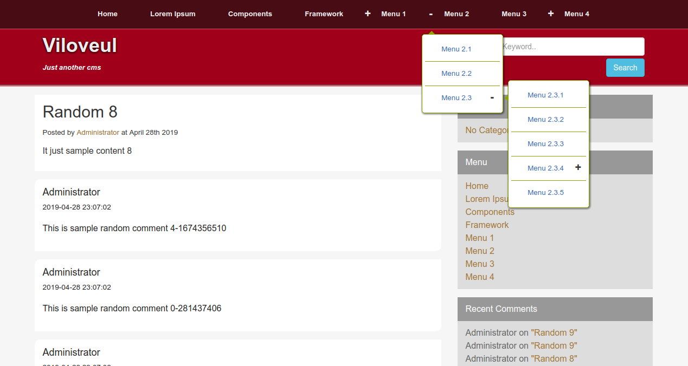

# Viloveul CMS (Consumer UI)



clone this repository
```bash
git clone https://github.com/zafex/viloveul-cms-consumer.git
```
lakukan proses instalasi
```bash
cd viloveul-cms-consumer
npm install
```
buat file bernama .env di root folder yang berisi minimal:
```bash
VILOVEUL_API_URL=http://your-viloveul-cms-api
VILOVEUL_DASHBOARD_URL=http://your-viloveul-cms-dashboard
```
jalankan:
```bash
npm run dev
## buka http://localhost:19913
```

@see https://github.com/zafex/viloveul-cms-dashboard

@see https://github.com/zafex/viloveul-cms-api


## PRERENDER

you can use a simple script like:

create new file on your root directory called <code>fake.php</code>
```php
error_reporting(0);
ini_set('display_errors', 'Off');

$api = 'http://YOUR.DOMAIN.TLD';
$path = trim(isset($_SERVER['PATH_INFO']) ? $_SERVER['PATH_INFO'] : '/', '/');
$template = __DIR__ . '/index.html';

try {
    $doc = new DOMDocument();
    $doc->loadHTMLFile($template);
    $xpath = new DOMXpath($doc);
    $title = $doc->getElementsByTagName("title");
    $meta = $xpath->query("*/meta[@viloveul-controlled-description]");

    // year month day
    if (preg_match('#^([0-9]+)/([0-9]{1,2})/([0-9]{1,2})$#', $path, $match)) {
        for ($a = 0; $a < $title->length; $a++) {
            $title->item($a)->nodeValue = 'Archive ' . date('j F Y', strtotime("{$match[1]}-{$match[2]}-{$match[3]}"));
        }
    } elseif (preg_match('#^([0-9]+)/([0-9]{1,2})$#', $path, $match)) {
        for ($a = 0; $a < $title->length; $a++) {
            $title->item($a)->nodeValue = 'Archive ' . date('F Y', strtotime("{$match[1]}-{$match[2]}-01"));
        }
    } elseif (preg_match('#^([0-9]+)$#', $path, $match)) {
        for ($a = 0; $a < $title->length; $a++) {
            $title->item($a)->nodeValue = 'Archive ' . $match[1];
        }
    } elseif (preg_match('#^[^/]+/([^/]+)\.html$#', $path, $match)) {
        for ($a = 0; $a < $title->length; $a++) {
            $title->item($a)->nodeValue = 'Archive ' . ucwords(str_replace('-', ' ', $match[1]));
        }
    } elseif (preg_match('#^@([^/]+)$#', $path, $match)) {
        for ($a = 0; $a < $title->length; $a++) {
            $title->item($a)->nodeValue = 'Author: ' . $match[1];
        }
    } elseif (!empty($path)) {
        $paths = preg_split('/\//', $path, -1, PREG_SPLIT_NO_EMPTY);
        $handler = curl_init($api . '/blog/detail/' . end($paths));
        curl_setopt($handler, CURLOPT_RETURNTRANSFER, 1);
        $response = curl_exec($handler);
        curl_close($handler);
        $result = json_decode($response, false);

        for ($a = 0; $a < $title->length; $a++) {
            $title->item($a)->nodeValue = $result->data->title;
        }

        for ($b = 0; $b < $meta->length; $b++) {
            $meta->item($b)->setAttribute('content', $result->data->description);
        }
    }
} catch (Exception $e) {
    // do nothing
}

echo $doc->saveHTML();

```

and .htaccess

```code
<IfModule mod_rewrite.c>
    RewriteEngine On
    RewriteBase /
    RewriteRule ^index\.html$ - [L]
    RewriteCond %{REQUEST_FILENAME} !-d
    RewriteCond %{REQUEST_FILENAME} !-f
    RewriteRule ^.*$ fake.php/$0 [L]
</IfModule>
```
